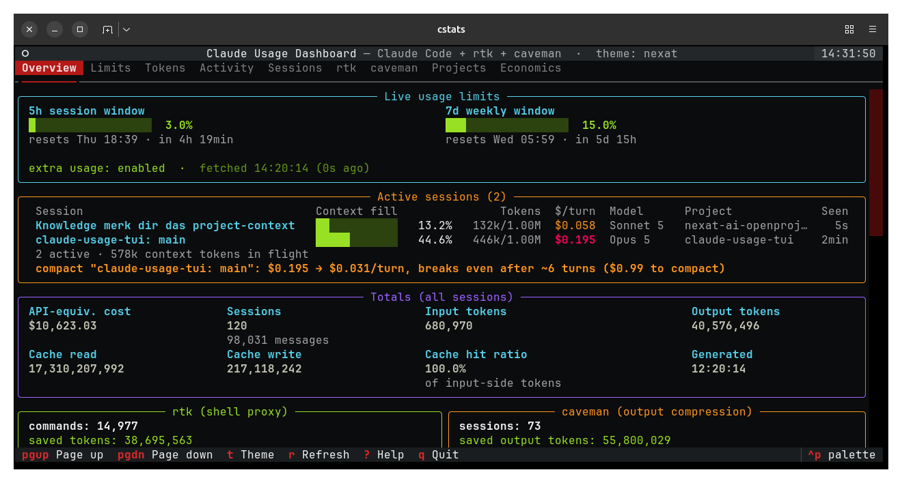

# cstats

A terminal TUI showing your whole Claude Code spend in one self-refreshing view, combining four data sources:

- **Claude Code sessions** — real tokens and cost from the local transcripts (`~/.claude/projects/*/*.jsonl`, deduplicated by `message.id`)
- **Live plan limits** — the actual 5h/7d utilization from the Anthropic OAuth endpoint (the same source `/usage` reads)
- **rtk** — savings of the shell proxy, from its SQLite DB (`~/.local/share/rtk/history.db`)
- **caveman** — savings of the output compression (`~/.claude/.caveman-history.jsonl`)
- **Claude Code telemetry** — what subagents, skills and MCP servers cost, scraped from
  Claude Code's own Prometheus endpoint

rtk, caveman and the telemetry are all optional and independent. With none of
them set up everything else still works — the limits, cost, tokens, sessions
and compaction advice depend on none of them — and each panel says what it is
missing.

Telemetry is the only source that can say **what subagents cost**: a subagent
writes no transcript, so that spend is invisible to every other panel here. To
turn it on, start Claude Code with:

```bash
export CLAUDE_CODE_ENABLE_TELEMETRY=1
export OTEL_METRICS_EXPORTER=prometheus
export OTEL_EXPORTER_PROMETHEUS_PORT=9464   # optional, this is the default
```

The figures then appear in the Economics tab. They are counters inside the
running Claude Code process, so they start at zero with it and one endpoint
covers one process — the panel states both.



The Overview tab above shows the two things the tool exists to answer, top to bottom: how much of the plan window is gone, and what each running session costs per turn — here `$0.195/turn` at 446k of context, with the compaction hint working out that it breaks even after ~6 turns.

## Start

```bash
./bin/cstats          # creates .venv on first run, then starts the TUI
```

or manually:

```bash
python3 -m venv .venv
.venv/bin/pip install -r requirements.txt
.venv/bin/python -m cstats
```

The live limits need a Claude Code login: the tool reads the OAuth token out of `~/.claude/.credentials.json` and never writes there. Without it the Limits tab says so and every other number still works.

## Install & update

```bash
./bin/cstats --install      # symlink into ~/.local/bin/cstats + PATH hint
./bin/cstats --uninstall    # remove the symlink
./bin/cstats --update       # git pull + reinstall deps (needs a git remote)
./bin/cstats --version
```

The symlink points at the repo, so a `git pull` takes effect immediately — nothing to copy.

## Headless modes (tmux/prompt/cron)

```bash
./bin/cstats --line    # one line:  5h 40% | 7d 35% | $9,643 | 66s | rtk +398,343 | cav +98,234
                         # savings are this tool's corrected figures, not rtk's/caveman's own
./bin/cstats --json    # the whole dashboard as JSON (machine-readable)
```

`--line` suits `set -g status-right` in tmux or a PS1:
`status-right '#(cstats --line)'`

## Tabs & keys

| Tab | Contents |
|---|---|
| Overview | live limits (5h/7d), totals, rtk & caveman summary, top models |
| Limits | 5h/7d values plus the Opus/Sonnet weekly caps where the plan has them, reset times, **pace indicator** (spent vs. elapsed window time) |
| Tokens | daily cost/tokens (30 days), bar chart, sparkline |
| Activity | weekday/hour heatmap, bucketed per message |
| Sessions | one row per session, sortable and filterable |
| rtk | total savings, daily history, top projects |
| caveman | lifetime savings, daily history, latest snapshot |
| Projects | cost per project |
| Economics | cost per turn, compaction break-even, billing rates, telemetry (subagent/skill/MCP cost) |

Keys: `1-9` jump to a tab, `tab`/`shift+tab` next/previous, `↑/↓` scroll a line, `pgup/pgdn` scroll a page, `home/end` top/bottom, `t` cycle theme (persisted), `r` refresh now, `s`/`S` sessions sort column/direction, `/` filter sessions, `?` help, `,` settings, `q` quit.

## Themes

Textual ships 21 themes; **orange** (the default) and **nexat** are registered on top.
Cycle with `t` (persisted in `~/.config/cstats/config.json`), or:

```bash
cstats --theme nord
```

## Terminal modes

Default: alternate screen (no flicker, clean exit). If that misbehaves in tmux/WSL:

```bash
cstats --inline
```

## Cache

On start a snapshot from `~/.cache/cstats/dashboard.json` is shown immediately, then a background refresh reads the real sources. `--no-cache` turns the cache off. On an error the TUI keeps running and shows an error banner over the last known data. Cache files are written 0600 — they carry project paths, session names and spend.

## Data sources

| Source | Path | What it gives |
|---|---|---|
| session transcripts | `~/.claude/projects/*/*.jsonl` | tokens, cost, sessions |
| live limits | `GET api.anthropic.com/api/oauth/usage` | 5h/7d utilization in %, per-model weekly caps, extra-usage credits |
| rtk | `~/.local/share/rtk/history.db` | `commands` table, 90 days |
| caveman | `~/.claude/.caveman-history.jsonl` | lifetime savings |
| telemetry | `GET 127.0.0.1:9464/metrics` | cost/tokens by subagent, skill, MCP server |

Costs are hypothetical API-equivalent prices from the standard price list, not a real bill.

**rtk's and caveman's own savings figures are not used as they stand.** rtk prices the full
untruncated command output, which Claude Code would never have let into the context; caveman
counts every content-block line as another answer. Both are corrected against measurements from
your own transcripts, and the panel shows the reported number next to the counted one. See
`ARCHITECTURE.md` §2b.

## Layout

```
cstats/
  cli.py           # CLI: install/update/json/line/version/theme/inline
  app.py           # Textual TUI (tabs, auto-refresh, cache-first)
  views.py         # render function per tab (sparkline, pace)
  screens.py       # help (?) and settings (,) modals
  themes.py        # custom themes orange + nexat
  config.py        # persistence (~/.config/cstats/config.json)
  claude_parser.py # JSONL parser (message.id dedupe, ISO timestamps)
  limits.py        # OAuth limits endpoint
  limit_history.py # utilization snapshots for the sparkline
  rtk.py           # SQLite reader
  caveman.py       # JSONL reader
  pricing.py       # model price table + cost/credits
  economics.py     # cost per turn, compaction break-even
  compacts.py      # compaction history from the transcripts
  session_cache.py # incremental per-file parse cache
  otel.py          # Claude Code telemetry (Prometheus scrape, optional)
  aggregate.py     # aggregation + JSON serialization (cache)
  service.py       # thread-safe data holder, cache + refresh
  notify.py        # desktop notifications
```

## Docs

`AGENTS.md` — rules for anyone (human or agent) working on this repo.
`ARCHITECTURE.md` — why the tool exists, what it measures, and how it is built.
`CONTEXT.md` — where the work currently stands.
